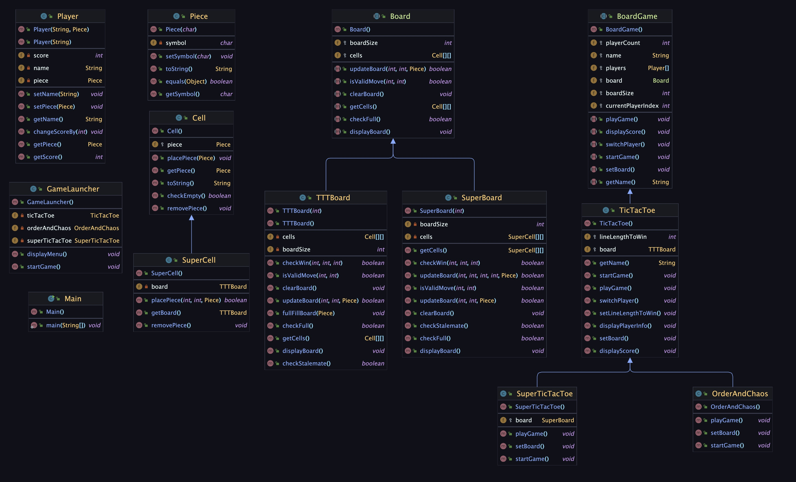

# Design Documentation

> Name: Yifei Bao
>
> Email: baoyifei@bu.edu
>
> Student ID: U02463348

### Class Structure

In my design, there are 4 basic components of a board game that are represented as classes. These are the `Piece`, `Cell`, `Board`, and `Player` classes. The `Board` class is responsible for managing the game board and all cells, the `Piece` class is responsible for managing the pieces on the board, the `Cell` class is responsible for storing pieces and managing the cells on the board, and the `Player` class is responsible for managing the players in the game. All of these classes are used or extended to create a game of chess.

Then it comes to the `BoardGame` class, which is responsible for managing the game itself. It has a `Board` object, a list of `Player` objects. The `BoardGame` class is responsible for managing the game state, the game loop and user interactions. 

The `TicTacToe` class extends the `BoardGame` class and implements the game logic for Tic Tac Toe with additional member *lineLenthToWin* and specific `TTTBoard` type board. Since the game Order And Chaos and Super Tic Tac Toe are all based on Tic Tac Toe, they are also extended from `TicTacToe` class with their own implementation of game logic.

The `TTTBoard` class extends the `Board` class and implements the board for Tic Tac Toe and Order And Chaos. It has a 2D array of `Cell` objects, each of which can store a `Piece` object. The `TTTBoard` class is responsible for managing the cells on the board and checking for wins.

The `SuperBoard` class also extends the `Board` class and implements the board for Super Tic Tac Toe. It has a 2D array of `SuperCell` objects, each of which store a Tic Tac Toe board and a super piece. The `SuperBoard` class is responsible for managing the super Tic Tac Toe board and checking for wins.

The `SuperCell` class extends the `Cell` class and implements the cell for Super Tic Tac Toe. It has a `TTTBoard` object and a super piece. The `SuperCell` class is responsible for managing the pieces on the small boards and checking for wins.

To run the game, the `Main` class is used. It uses the `GameLauncher` class to start the game. The `GameLauncher` class is responsible for starting the game and handling user input.

### Scalability and Extendibility

In class `BoardGame`, players are stored in a list. This allows for any number of players to be added to the game instead of being limited to 2 players. Thus, in the method *switchPlayer*, I used the modulus operator to get prepared for multiplayer situation. The `BoardGame` class contains simple game logic and can be extended to create new games by extending the `BoardGame` class and implementing the game logic. The `TTTBoard` class can be extended to create new games as long as it is a board game. Because all board games have a board, players and the methods in the `BoardGame` class can also be used for any board game.

Also, any board game can have its board extended from the `Board` class like `TTTBoard` or `SuperBoard`. Because all boards are composed of cells and need to update and display, etc. The `Cell` class can be extended to create new types of cells like `SuperCell`. Because all cells need to place and get pieces etc.

In the game Tic Tac Toe, user can customize the size of the board (3-9) and even change the rule for how many pieces need to be in a line to win. The line length to win should be no more than the board size, of course. With the member *boardSize* and *lineLengthToWin* reserved instead of fixed, the game can be easily customized to other similar games. For example, if you wanna design a new game Connect Four, you can just change the *boardSize* and set *lineLengthToWin* to 4.

### Changes to my Design
1. I put the method checkWin and checkStalemate in the `TTTBoard` class instead of game class. Because it is more reasonable to let the board to check the status of the board. I did not put checkWin in the abstract board class, because different board games may have different win methods. But with the checkWin method in the `TTTBoard`, all TicTacToe like games can use this method by customizing the input rule.
2. I added a new class cell Piece to represent the piece in the game.
3. I added a new abstract class `Board` to represent the generic board in the game. The `TTTBoard` and `SuperBoard` all extend `Board` class.
