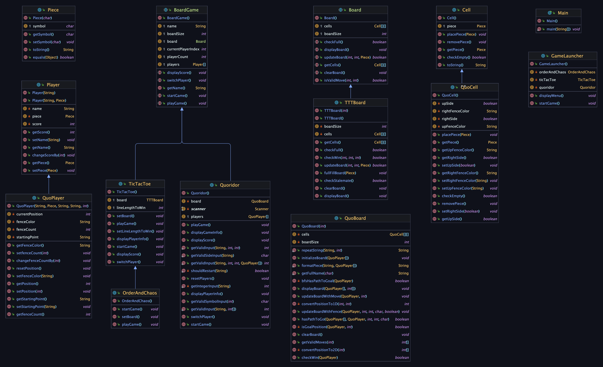

# Design Documentation

> Name: Yifei Bao, Yuanhang Xu
>
> Email: baoyifei@bu.edu, xxxqivzz@bu.edu
>
> Student ID: U02463348, U04774035

### Class Structure

In my design, there are 4 basic components of a board game that are represented as classes. These are the `Piece`, `Cell`, `Board`, and `Player` classes. The `Board` class is responsible for managing the game board and all cells, the `Piece` class is responsible for managing the pieces on the board, the `Cell` class is responsible for storing pieces and managing the cells on the board, and the `Player` class is responsible for managing the players in the game. All of these classes are used or extended to create a game of chess.

Then it comes to the `BoardGame` class, which is responsible for managing the game itself. It has a `Board` object, a list of `Player` objects. The `BoardGame` class is responsible for managing the game state, the game loop and user interactions. 

The `TicTacToe` class extends the `BoardGame` class and implements the game logic for Tic Tac Toe with additional member lineLenthToWin and specific `TTTBoard` type board. Since the game Order And Chaos is based on Tic Tac Toe, it is extended from `TicTacToe` class with its own implementation of game logic.

The `Quoridor` class extends the `BoardGame` class and implements the game logic for Quoridor with specific `QuoridorBoard` type board. The `Quoridor` class is responsible for managing the game state, the game loop and game flow for the Quoridor game.

The `TTTBoard` class extends the `Board` class and implements the board for Tic Tac Toe and Order And Chaos. It has a 2D array of `Cell` objects, each of which can store a `Piece` object. The `TTTBoard` class is responsible for managing the cells on the board and checking for wins.

The `QuoPlayer` class represents a player in the Quoridor game. It extends the `Player` class and contains additional information of a player in the Quoridor game. It contains the fence color, fence count, current position, and starting point of the player. It contains getters and setters for these attributes, and methods to reset the player’s position. In this design, a QuoPlayer has fenceColor, fenceCount, currentPosition, and startingPoint attributes. Each player has a unique color to represent their fences and pieces. Each player has a number of fences to place on the board. Each player has a starting point representing the initial position and winning goal.

The `QuoridorBoard` class represents the Quoridor board. It contains the size of the board and a 2D array of `QuoCell` objects that represent the board. It contains methods to initialize the board, update the board with player moves and fence placements, check if a player has a path to their goal, check if a player has won, and display the board. 
In this design, a fence is represented by a boolean value in the QuoCell class. A fence can be placed on the right or up side of a cell. When displaying the board, a fence is represented by a vertical or horizontal line between cells with a color to indicate the player.

The `QuoCell` class represents a cell in the Quoridor board. It extends the Cell class and contains additional information of a cell in the Quoridor board. It contains the piece on the cell, the up and right sides of the cell. It contains methods to check if the cell is empty, place a piece on the cell, remove a piece from the cell, and getters and setters. 
In this design, a QuoCell has upSide and rightSide attributes to represent the fences on the cell (not 4 sides to save resources). It also has upFenceColor and rightFenceColor attributes to represent the color of the fences, which will be used to display fences of different players in different colors.

To run the game, the `Main` class is used. It uses the `GameLauncher` class to start the game. The `GameLauncher` class is responsible for starting the game and handling user input.

### Scalability and Extendibility

In class `BoardGame`, players are stored in a list. This allows for any number of players to be added to the game instead of being limited to 2 players. Thus, in the method switchPlayer, I used the modulus operator to get prepared for multiplayer situation. And indeed in the Quoridor game, players can choose the amount of players (2 or 4) to play the game. 

The `BoardGame` class contains simple game logic and can be extended to create new games by extending the `BoardGame` class and implementing the game logic. The `TicTacToe` and `Quoridor` classes are all extended from `BoardGame` class.

The `Piece`, `Cell`, `Board`, and `Player` classes are all basic classes that can be extended or used to create new games. For example, the `Piece` class is directly used in all the three games because it is designed to have simple and single responsibility. The `Cell` class can be used or extended to create new types of cells for a game, i.e. `QuoCell` class. The `Player` class can be used or extended to create new types of players for a game, i.e. `QuoPlayer` class.

In the game Tic Tac Toe, user can customize the size of the board (3-9) and even change the rule for how many pieces need to be in a line to win. The line length to win should be no more than the board size, of course. With the member *boardSize* and *lineLengthToWin* reserved instead of fixed, the game can be easily customized to other similar games. For example, if you wanna design a new game Connect Four, you can just change the *boardSize* and set *lineLengthToWin* to 4.

### Special Features
1. In the Quoridor game, each player is highlighted by a unique color in the board display. The pieces and fences are all displayed in the corresponding player's color. We think this feature can help players to distinguish the pieces and fences of different players more intuitively.
2. In the Quoridor game, When a player chooses to make a move, the program uses Breadth-First Search (BFS) to automatically calculate and mark all valid moves in purple on the board. This feature helps players by removing the need to manually evaluate moves, streamlining their decision-making process.
3. In the Quoridor game, players can choose the amount of players (2 or 4) to play the game. When there are 4 players.
4. In the Quoridor game, the way to place a fence is to input the numbers of 2 cells where the fence is placed and on which side is the fence placed. For example, if a player wants to place a fence between cell 1 and cell 2 on the down side, the player should simply input "1 2 D". The program will automatically check if the fence is placed in a valid position and if the fence blocks any player's path to the destination. When a player places a fence, game uses Breadth-First Search (BFS) to ensure that the new fence does not block any player’s path to their destination. We think this feature and input instructions can help players place fences more intuitively and easily.
5. When placing a fence, if there is piece in the cells and player wants to put a fence near the piece, the program will allow player to just type the piece symbol and side, without the need to recognize the cell numbers. 
6. When player thinks he made a wrong option, he can just type 0 to go back to the upper option. For example, when choosing fences player can type 0 to go back to the upper option to choose move or fences.
